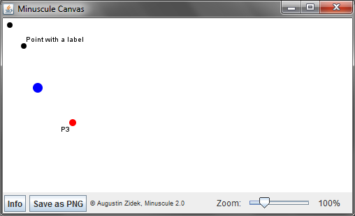
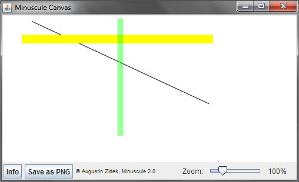
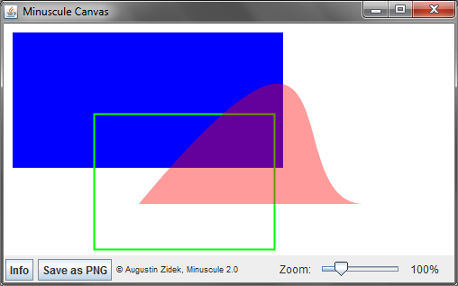
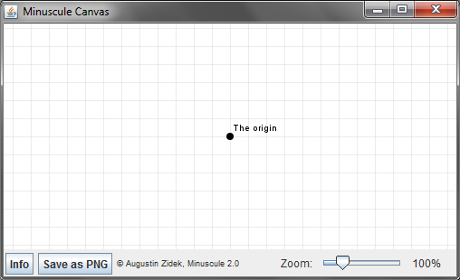
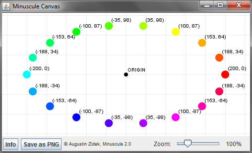
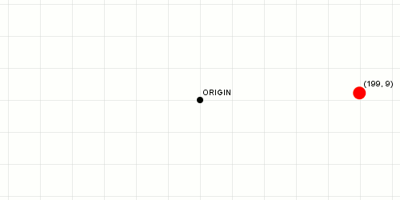

# Minuscule Java Graphics Library

## What is Minuscule?

- _Simple_ Java library for rapid prototyping of algorithms with graphic output
- Free and open source
- Initialises canvas in just **two lines of code**
- Creates a canvas with **zoom**, **drag-and-move** and **single click
  screen-shot** support with no effort
- Saves your time (and swearing) if you want to try something with graphics
  quickly
- Small (less than 150 kB) and fast tool, follows the KISS principle
- Focuses on clean design, uses the
  [Builder pattern](http://en.wikipedia.org/wiki/Builder_pattern) for readable
  code
- Highly customizable, feel free to download and modify for your needs
- Its author is open for new ideas and suggestions (see contact details above)

## What is Minuscule not (per se)?

- It is not a game engine
- It is not a replacement for OpenGL or any other proper big graphics library
- It is not a 3D graphics library

## Short tutorial with examples

Using Minuscule is easy, it is in fact one of its main principles. To start, you
only need to type in these lines:

```java
// Import the Minuscule library
import eu.zidek.augustin.minuscule.*;
...
// The arguments of MinusculeWindow() are the width and the height
MinusculeWindow window = new MinusculeWindow(800, 600);
// Now obtain the canvas and you are ready to draw by calling appropriate canvas methods
Canvas canvas = window.getCanvas();
```

That's it! Now you can use all the methods that `canvas` provides for you. It is
quite possible you will need to import also other Java classes that are used in
this project, such as `java.awt.Color`, `java.awt.Font` or `java.awt.Shape`.

### Drawing points

There are four methods available for drawing points (also with labels):

```java
// Draw default point with coordinates (10, 10)
new MPoint().x(10).y(10).draw(canvas);

// Draw point with a label, placed next to the point
new MPoint().x(30).y(40).label("Point with a label").draw(canvas);

// Draw blue point with diameter = 14
new MPoint().x(50).y(100).diameter(14).color(Color.BLUE).draw(canvas);

// Draw red point with diameter = 10 and label at 225 degrees
new MPoint().x(100).y(150).diameter(10).color(Color.RED)
    .label("P3", 225).draw(canvas);
```



### Drawing lines

Two methods are available for drawing lines:

```java
// Draw line from (50,10) to (350,150)
new MLine().start(50, 10).end(350, 150).draw(canvas);

// Draw line with given thickness and color
new MLine().start(350, 40).end(40, 40).thickness(15)
    .color(Color.YELLOW).draw(canvas);

// Draw semi-transparent green line
new MLine().start(200, 10).end(200, 200).thickness(10)
    .color(new Color(0, 255, 0, 100)).draw(canvas);
```



### Drawing shapes

Minuscule can draw any `Shape` as defined in the standard Java libraries:

```java
import java.awt.Color;
import java.awt.Shape;
import java.awt.geom.CubicCurve2D;
...
// Draw a rectangle and fill it
new MRectangle().pos(10, 10).dimensions(300, 150).color(Color.BLUE)
    .fill(true).draw(canvas);

// Draw an unfilled rectangle
new MRectangle().pos(100, 100).dimensions(200, 150).color(Color.GREEN)
    .fill(false).draw(canvas);

// Draw a custom shape - a Bezier curve
Shape bezier = new CubicCurve2D.Double(150, 200, 400, -100, 300, 200,
    400, 200);
new MShape(bezier).color(new Color(255, 0, 0, 100)).fill(true)
    .draw(canvas);
```



### Drawing grid and using Euclidean coordinates

Drawing grid is very easy with Minuscule. Also, it is often very convenient to
use Euclidean style coordinate system instead of the computer graphics standard
one (i.e. origin in the top left corner, y increases downwards). Switching to
Euclidean coordinates is very easy as well:

```java
// Draw grid with the given column and row size
canvas.drawGrid(20, 20);

// Use Euclidean coordinates
canvas.setEuclideanCoordinates(true);

// Draw the origin with a label
new MPoint().pos(0, 0).label("The origin").draw(canvas);
```



### Playing with Minuscule

```java
// Switch to Euclidean coordinate system
canvas.setEuclideanCoordinates(true);
// Constant to enable easy deg-->rad
final double deg2rad = 2 * Math.PI / 360;

canvas.drawGrid(40, 40);

// Draw an ellipse with r1 = diameter, r2 = 2*diameter
final int diameter = 100;
for (int i = 0; i < 360; i += 20) {
  // Calculate the coordinates
  final double x = Math.cos(i * deg2rad) * 2 * diameter;
  final double y = Math.sin(i * deg2rad) * diameter;

  // Calculate color of the point
  final Color pointColor = Color.getHSBColor(i / 360F, 1F, 1F);

  final String coordLabel = String.format("(%.0f, %.0f)", x, y);
  new MPoint().pos(x, y).label(coordLabel, 45).diameter(16)
      .color(pointColor).draw(canvas);
}
new MPoint().pos(0, 0).label("ORIGIN").draw(canvas);
```



### Animation with Minuscule

```java
// Switch to Euclidean coordinate system
canvas.setEuclideanCoordinates(true);
// Constant to enable easy deg-->rad
final double deg2rad = 2 * Math.PI / 360;

canvas.drawGrid(40, 40);

// Draw an ellipse with r1 = diameter, r2 = 2*diameter
final int diameter = 100;

new MPoint().pos(0, 0).label("ORIGIN").draw(canvas);

// Animate the point
final MPoint p = new MPoint();
int angle = 0;
while (true) {
  angle = (angle + 5) % 360;
  // Calculate the coordinates
  final double x = Math.cos(angle * deg2rad) * 2 * diameter;
  final double y = Math.sin(angle * deg2rad) * diameter;

  // Calculate color of the point
  final Color pointColor = Color.getHSBColor(angle / 360F, 1F, 1F);

  final String coordLabel = String.format("(%.0f, %.0f)", x, y);
  p.pos(x, y).label(coordLabel, 45).diameter(16).color(pointColor)
      .draw(canvas);
  // Display for 50 ms and then continue
  Thread.sleep(50);
}
```


